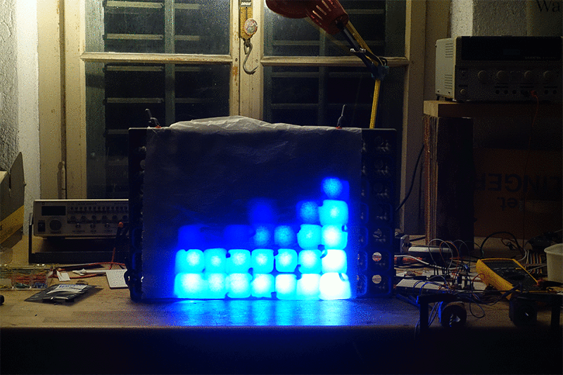

# PlannedHoliday

**Moorescloud Holiday** was a "smart" 50 bulbs christmas light. 

Let's make a crappy 7x7 pixel display out of it! The code on this repo uses the Holiday's [secret UDP API](https://github.com/moorescloud/secretapi) to display pixel art and visualizations on it.

The company who sold it (Moorescloud) is longer in business. However, its developer shares some insights on his [personal website](http://kean.com.au/oshw/Holiday/).
